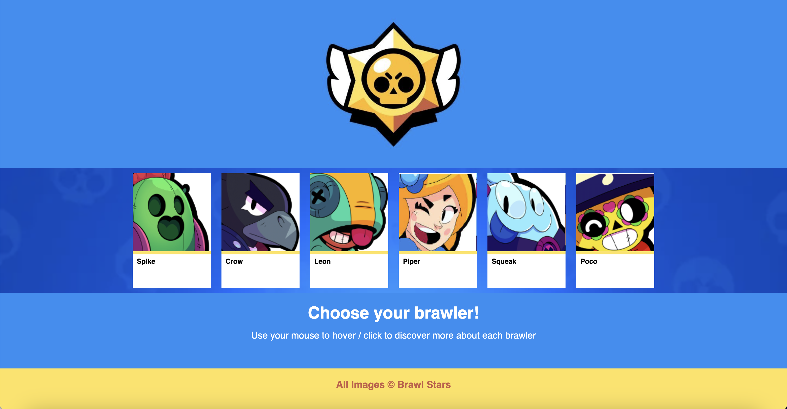
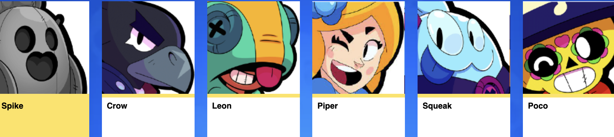
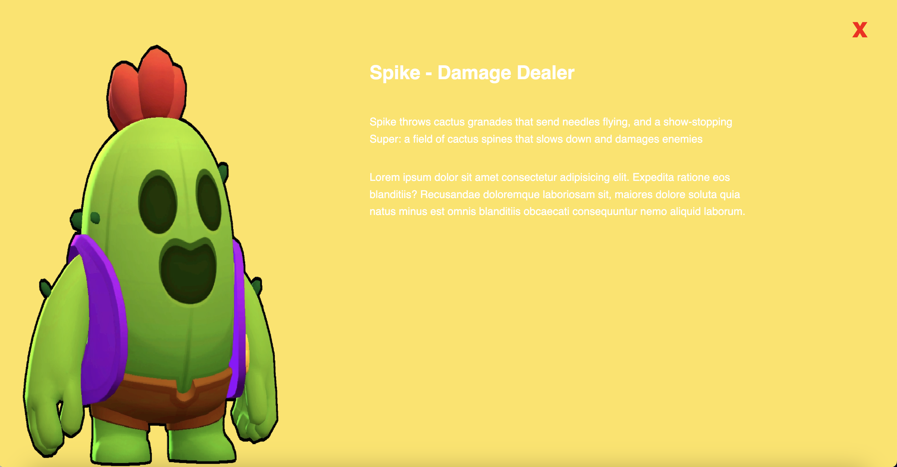

# Brawl Stars - Informative and Interactive Website

## About Brawl Stars:
Brawl Stars is a multiplayer mobile video game available on Android and iOS, developed by Supercell and released globally in 2018.

### Main page
You can select the brawler of your preference!

### Menu
By hovering the mouse over the portrait image of each character you will be able to find out what kind of fighter it is and its name (there is also an animation):
- killer
- support
- marksman
- controller
- damage dealer

### Description for each brawler!
*Once you select your character*, a new window will open where you can find relevant information about that specific brawler with his own image of how he would look in game.

